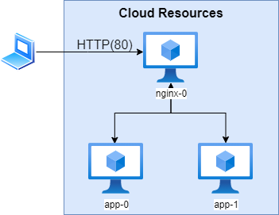

# DevOps/SRE Project
This project assignment asks you to create a basic deployment in a cloud environment. Please use whatever framework/language/environment you are most familiar with. We use AWS and like CDK and Pulumi. Feel free to question the requirements and make suggestions you think are an improvement. Part of the exercise is engaging in a technical discussion with you. We want to dig in and understand how you think as well as how you code.

## Project Overview
You will create an environment and then configure the deployed resources. The deployed application will be the `app/` folder provided here which is a simple Node.js web server. The architecture must match the following diagram with 3 small vms. The nginx reverse-proxy should use a simple round-robin load balancing scheme between 2 instances of the app running on separate virtual machines.

## Deliverables
Your solution will be evaluated based on these major components.
* Cloud environment setup 
* Resource configuration
* HTTP Accessible Application
* Documentation of the solution
* **(OPTIONAL)** CI/CD Pipeline (GitHub Actions

### **(OPTIONAL)** CI/CD Pipeline
Create a CI/CD pipeline using GitHub actions to complete the following steps whenever there is a commit to the **master** branch of your solution.

1. Deploy/Update cloud resources
1. Configure cloud resources

## Submission
Your submission should be accessible in a public git repository where the nested `README.md` files have been populated with pertinent information. The expectation is that we can easily follow the steps provided and deploy your deliverables without much guesswork. 

If your submission does include additional artifacts that are not represented within the repository - include information on how to retrieve and access those items in the associated nested `README.md`.

## Referencing Code
If you reference and copy other published works be sure to clearly cite those works in your solution. It is acceptable to use community packages as long as you call this out.
